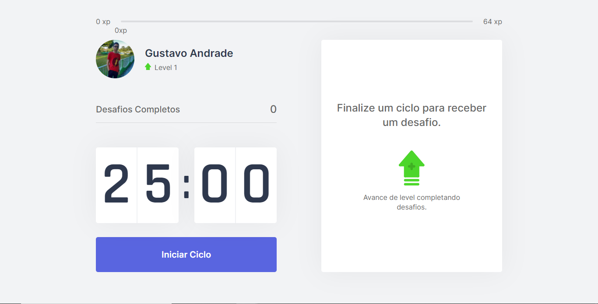
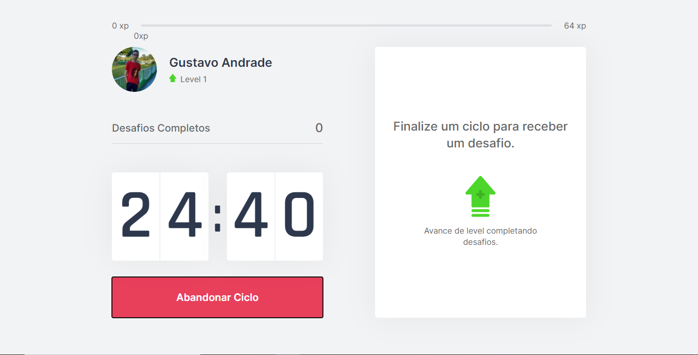
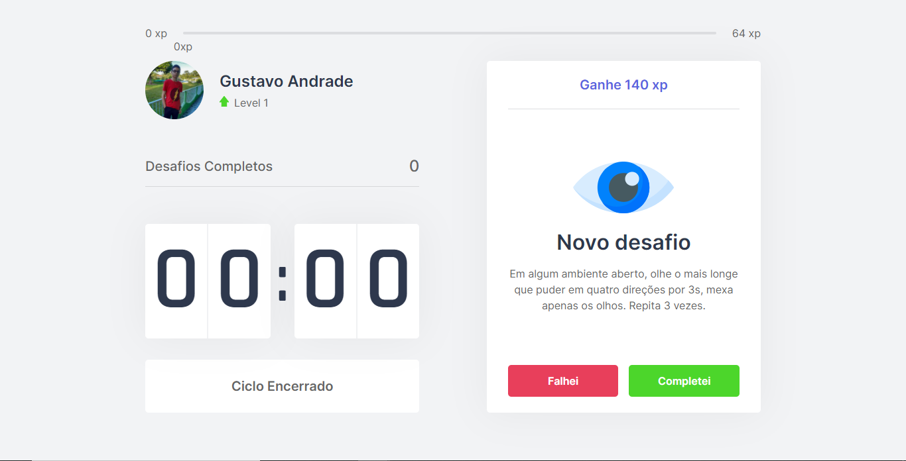
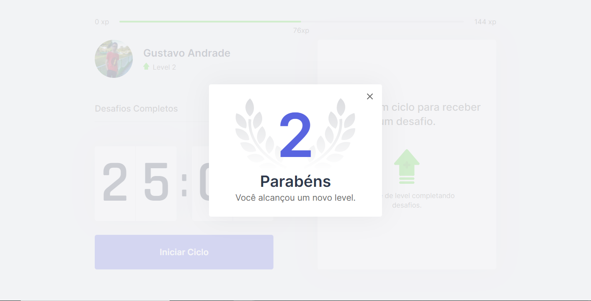
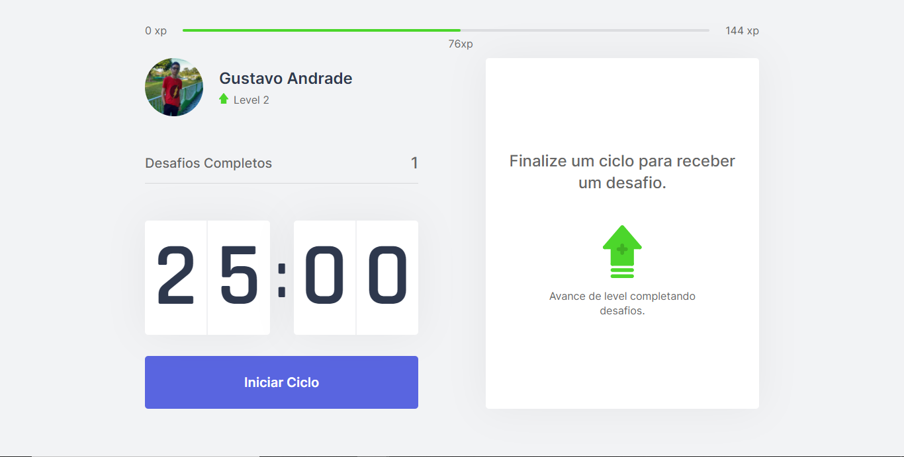

# move.it
 ## Next Level Week 04 (Rocketseat)

---

### Uma Aplicação Web desenvolvida em React durante a Trilha React da 4° edição da Next Level Week, da Rocketseat.

---

#### ==> 📸 Screenshots 📸:
 ##### • Screenshots:
   
   
   
   
   

---

#### ==> 📝 Resumo da Aplicação:
 ##### • O projeto original foi desenvolvido pela Rocketseat, na 4° edição do evento Next Level Week, do qual participei. O conceito por trás da aplicação é te ajudar com a sua saúde, pois passar muito tempo sentado no computador, ou no celular, e não fazer pausas para descansar, ou praticar exercícios físicos, é prejudicial à sua saúde, principalmente para as articulações do seu corpo. Então, a solução proposta pelo "Move.it" é utilizar da Técnica de Pomodoro para realizar pausas a cada 25 minutos, e te notificar para a prática de exercícios físicos leves, para os olhos e articulações do seu corpo. Conforme você realiza os exercícios e completa os desafios, você ganha experiência e sobe de nível.

---

 ##### • Como inicializar o projeto?
  1. Instale o Yarn.
  2. Instale o Node.js.
  3. Clone este repositório com o Git.
  4. Acesse a pasta do projeto e execute o comando `yarn` para instalar todas as dependências.
  5. Após o término das instalações, execute o comando `yarn dev` para inicializar o projeto na porta 3000 (`http://localhost:3000`), caso a porta 3000 esteja em uso, altere esta configuração através do `server.ts`.

---

 ##### • Como usá-lo?
  --> Para começar, inicie um Ciclo Pomodoro de 25 minutos, após a conclusão do mesmo, realize o desafio que será exibido e clique em "**completei**", após isso, você ganhará **experiência (xp)**, conforme você ganha experiência, realizando os desafios, você sobe de nível. Seu nível, sua experiêncial atual, e a experiência necessária para chegar no próximo nível, são exibidos ao lado da sua foto de perfil, e na barra de experiência localizada na parte superior da tela.

---

#### ==> ⚙️ Funcionalidades do App:
 1. Inicie, cancele e complete Ciclos Pomodoro, de 25 minutos. ⏱️
 2. Realize os desafios propostos ao final de cada ciclo e ganhe experiência. 🏋️‍♂️
 3. Suba de nível ao ganhar a experiência necessária completar o nível. ⬆️

---

#### ==> 🌐 Tecnologias Utilizadas:
 1. React.
 2. Next.
 3. TypeScript.
 4. Node.js.
 5. Yarn.

---

#### ==> 🚀🤝💜 Agradecimentos:
 Essa foi minha primeira Next Level Week (NLW), e eu tô muito feliz... 
 **Obrigado Rocketseat** 🚀💜. Nunca tinha desenvolvido em TypeScript, Next e nem em React antes, e mesmo assim, consegui aprender muita coisa, o que só demonstra o quão incrível é a didática de vocês e o quão dedicado eu estou em evoluir na programação e sempre buscar o próximo nível...

 #NextLevelWeek04
 #MissionComplete
 #NeverStopLearning
 🚀💜